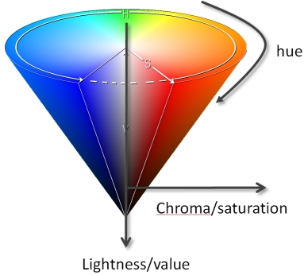
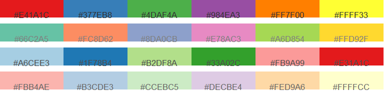
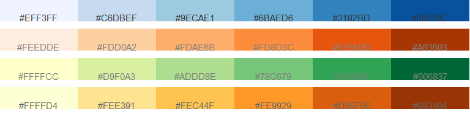
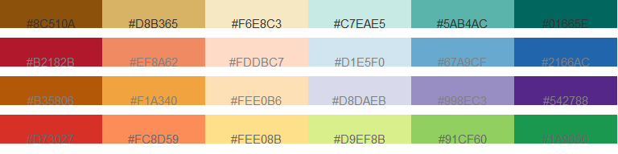
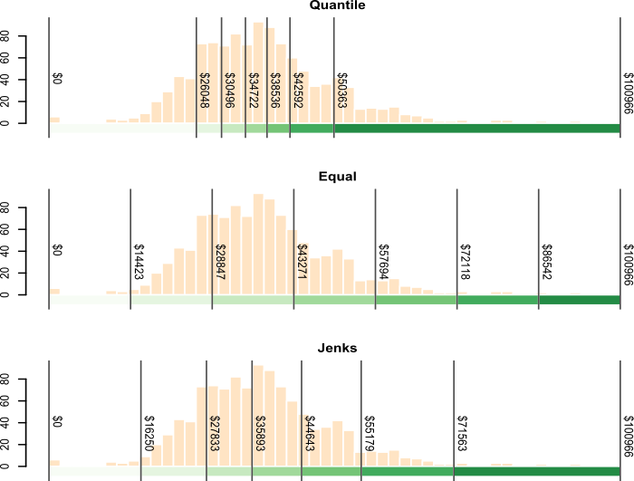

# 4.Symbolizing Features

## Color

Each color is a combination of three perceptual dimensions:

- Hue
- Lightness
- Saturation

### Hue

1. **Hue** is the perceptual dimension associated with color names.
2. Typically, we use different hues to represent different _categories_ of data. (One data -> one hue)

### Lightness

**Lightness** (sometimes referred to as _value_) describes how much light reflects (or is emitted) off of a surface.

### Saturation

**Saturation** (sometimes referred to as _chroma_) is a measure of a color’s vividness. You can use saturated colors to help distinguish map symbols.

## Color Space

Lightness, saturation, and hue are the cone’s height, radius, and circumference respectively.

## Classification

### Qualitative color scheme

Qualitative schemes are used to symbolize data having no inherent order (i.e. categorical data).

### Sequential color scheme

1. Sequential color schemes are used to highlight ordered data such as income, temperature, elevation, or infection rates.
2. A well-designed sequential color scheme ranges from a light color (representing low attribute values) to a dark color (representing high attribute values).
3. Such color schemes are typically composed of a single hue but may include two hues as shown in the last two color schemes of the following figure.

### Divergent color scheme

1. Divergent color schemes apply to ordered data as well. However, there is an implied central value about which all values are compared.
2. Typically, a divergent color scheme is composed of two hues–one for each side of the central value. Each hue’s lightness/saturation value is then adjusted symmetrically about the central value.

## Useful websites

The website is [http://colorbrewer2.org/](http://colorbrewer2.org/) and was developed by Cynthia Brewer _et. al_ at the Pennsylvania State University.

## Classification Intervals

### Quantile Interval scheme

The **quantile interval** scheme ensures that each color swatch is represented an equal number of times. (Each block's number of data should be equal)

### Equal Interval scheme

The **equal interval** scheme breaks up the range of values into equal interval widths.

### Jenks Interval scheme

The **Jenks interval** scheme (aka natural breaks) uses an algorithm that identifies clusters in the dataset. The number of clusters is defined by the desired number of intervals.

