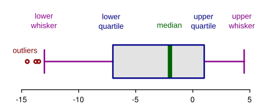

# 5.Statistical Maps

## Statistical distribution maps

### 1. Quantile map
Quantiles define ranges of values that have an equal number of observations.

### 2. Boxplot map

1. Lower outliers
2. Minimum ($Q_{0}$ or 0th percentile)
3. First quartile ($Q_{1}$ or 25th percentile)
4. Median ($Q_{2}$ or 50th percentile)
5. Third quartile ($Q_{3}$ or 75th percentile)
6. Maximum ($Q_{4}$ or 100th percentile)
7. Upper outliers

Then we use the first quartile, median, third quartile, and upper and lower “whiskers” that encompass 1.5 times the interquartile range. Also 0% and 100% to divide data into 6 classes (0%, lower whiskers, first quartile, median, third quartile, upper whiskers, 100%).

### 3. IQR map
The IQR map is a reduction of the boxplot map whereby we reduce the classes to just three: the interquartile range (IQR) and the upper and lower extremes.

1. Lower outlier (lower extremes)
2. First quartile ($Q_{1}$ or 25th percentile)
3. Third quartile ($Q_{3}$ or 75th percentile)
4. Upper outlier (upper extremes)

*PS: IQR -> (25%~75%)*

### 4. Standard deviation map
If the data distribution can be approximated by a _Normal_ distribution (a theoretical distribution defined by a mathematical function), the classification scheme can be broken up into different standard deviation units.

1. 3SD
2. 2SD
3. 1SD
4. Mean
5. -1SD
6. -2SD
7. -3SD

### 5. Outlier maps
So far, emphasis has been placed on the distribution of values which attempts to place emphasis on the _full_ range of values. However, there may be times when we want to place emphasis on the extreme values.

#### 5.1 Boxplot outlier map
We can tweak the boxplot map from the last section by assigning darker hues to observations outside the whiskers (outliers) and a single light-colored hue to all other values. By minimizing the range of color swatches, we place emphasis on the outliers.

1. Lower outliers
2. Minimum ($Q_{0}$ or 0th percentile)
3. Maximum ($Q_{4}$ or 100th percentile)
4. Upper outliers

#### 5.2 Standard deviation outliers
In this next example, we use the +/- 2 standard deviation bounds from the _Normal_ distribution to identify outliers in the income data. Hence, if the data were to follow a perfectly Normal distribution, this would translate to roughly the top 2.5% and bottom 2.5% of the distribution.

1. $-\infty$ ~ -2SD
2. 2SD ~ $\infty$

#### 5.3 Quantile outliers
In this last example, we’ll characterize the top and bottom 2.5% of values as outliers by splitting the data into 40 quantiles then mapping the top and bottom quantiles to capture the 2.5% of values.

1. 0~2.5%
2. 97.5%~100%

## Mapping uncertainty
Need further studying.  
Stay for studying...
