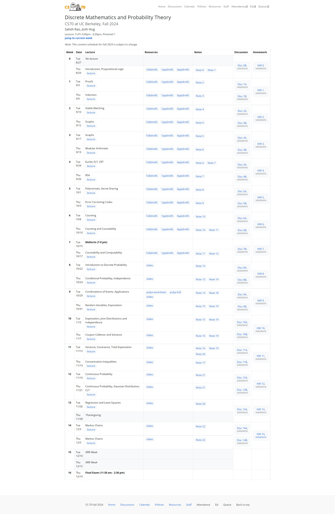

# Guide

1. 课程视频  
	[Bilibili 视频链接](https://www.bilibili.com/video/BV1e1421r74V?vd_source=693f010744accaf92a808489a5e7e31f)

2. 课程资源  
	本地已存 CS70 的各项资源

3. Tip  
	[Survival Tips](https://www.eecs70.org/resources/survival-tips)

4. 工作流
	 1. 首先课前阅读 NOTE
	 2. 听 lec 并手写笔记
	 3. 大致阅读 HW 并完成 discussion (手写后 latex)
	 4. 整理笔记 (markdown in Obsidian)
	 5. 完成 HW (latex!!!) -> 用 iPad 手写修改
	 6. 回顾整理笔记结合 slide

5. NOTE-lec-discussion-hw 对应关系如下

	
